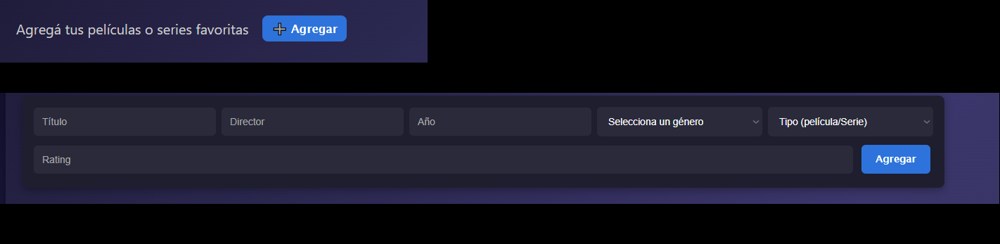
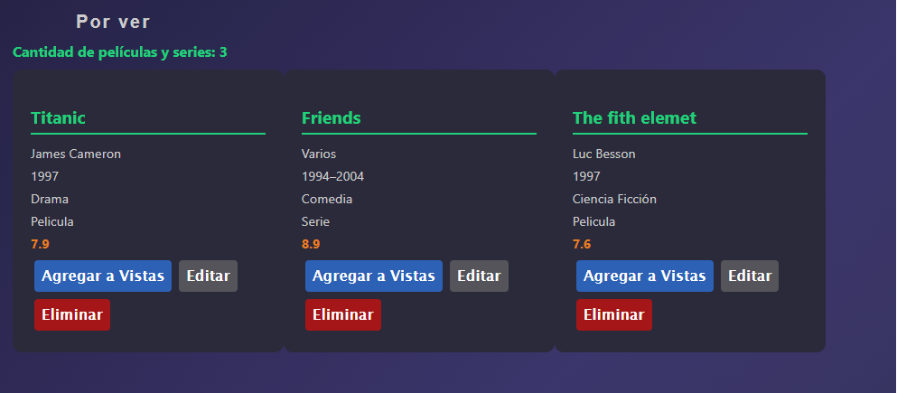
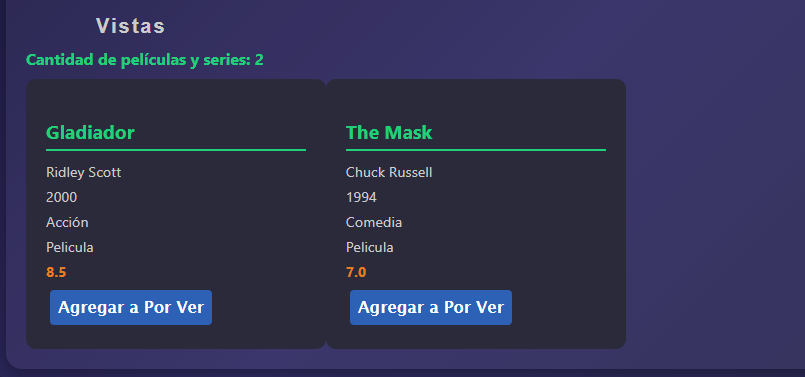

# 🎬 VideoClub Del Comahue

  

## ℹ️ Información del proyecto

**Nombre del proyecto: VideoClub Del Comahue**   
**Materia: Programacion Web Avanzada**  
**Profesor:Agustin Chiarotto**  
**TP nº 1 (React + Vite)** 

## 👥 Integrantes del grupo

- Francisco Pandolfi FAI-4610
- Leandro Resler FAI-4275
- Martín Paredes FAI-4997

## 📌 Descripción de la aplicación

Este proyecto consiste en una aplicación web desarrollada con React que permite gestionar una lista de películas y poder visualizar
tanto sus caracteristicas como su estado (vista/noVista).

### Funcionalidades principales:

- ✅ Agregar películas a una lista.
- 👁️ Filtrarlas por genéro, tipo, año, etc.
- 🔍 Buscar películas por titulo o director.
- 🔄 Mover películas entre listas de vistas y no vistas

---

## 🧪 Tecnologías utilizadas

- React
- JavaScript
- HTML / CSS
- Node.js
- Vite

---

## 🛠️ Instrucciones de instalación y ejecución

1.Crear el repositorio en github.
2.Abrir la terminal e instalar react en el proyecto con el comando npm create vite@latest mi-app-react -- --template react.
3.Los colaboradores clonan el repositorio en una carpeta (ya sea mediante un comando en la terminal o por URL).
4.En la terminal, utilizar el comando npm install para instalar las dependencias (guardadas en el archivo package.json) y dejar listo el proyecto para empezar.

---

## Instruccion de uso de la app

1-En la imagen se puede ver la opcion de agregar peliculas a las listas, que por defecto iran a listas "por Ver"
.

2-En la siguiente imagen se muestra un input para buscar una pelicula, entre ambas listas, ingresando el titulo o nombre de director.
.

3-Filtrado de peliculas. Completamente configurable por el usuario, permitiéndole elegir entre diferentes opciones según su preferencia
.

4-Se visualizan las peliculas "porVer"
.

5-Se visualizan las peliculas "Vistas"
.

## 🗂️ Archivos principales del proyecto

### `main.jsx`

Es el punto de entrada principal de la aplicación. Este archivo se encarga de renderizar el componente principal <App/> dentro del DOOM.

### `App.jsx`

Es el componente principal de la aplicación. Aquí se organizan y renderizan los distintos componentes del proyecto. También suele ser el lugar donde se maneja el estado global y se define la estructura general de la interfaz.

### `index.css`

Archivo donde se colocan los estilos globales de la aplicación.
Se aplica a toda la app.

### `package.json`

Este archivo contiene información importante del proyecto como:

- Nombre, versión y descripción del proyecto.
- Todas las dependecias necesarias para que la aplicación funcione
- Se genera automaticamente, al igual que los anteriores archivos.
